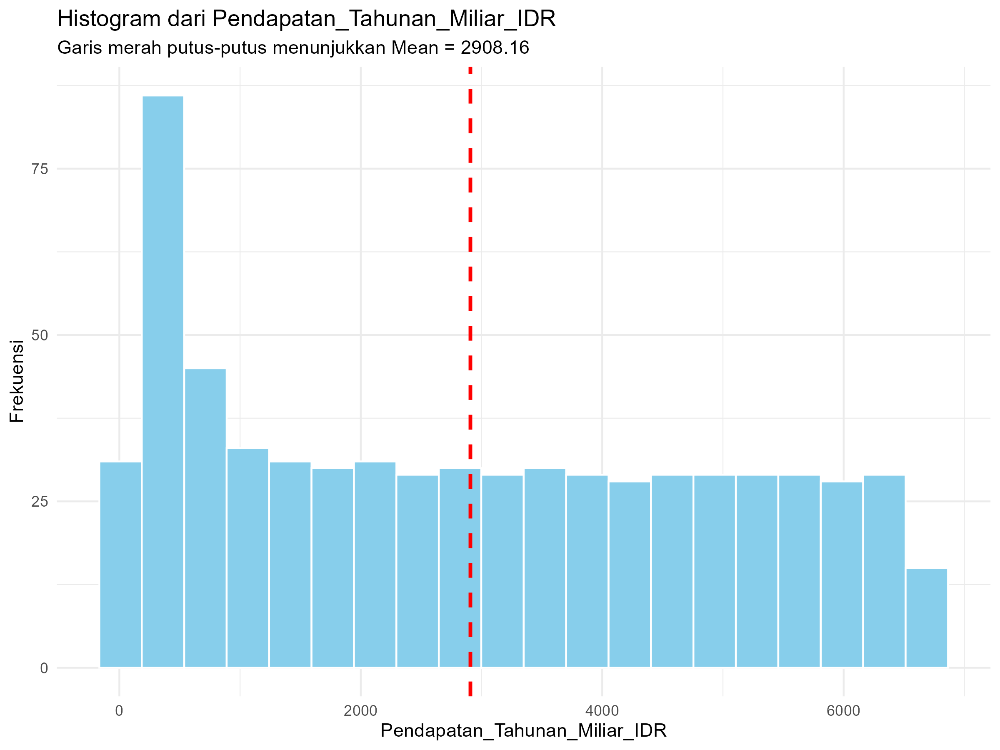
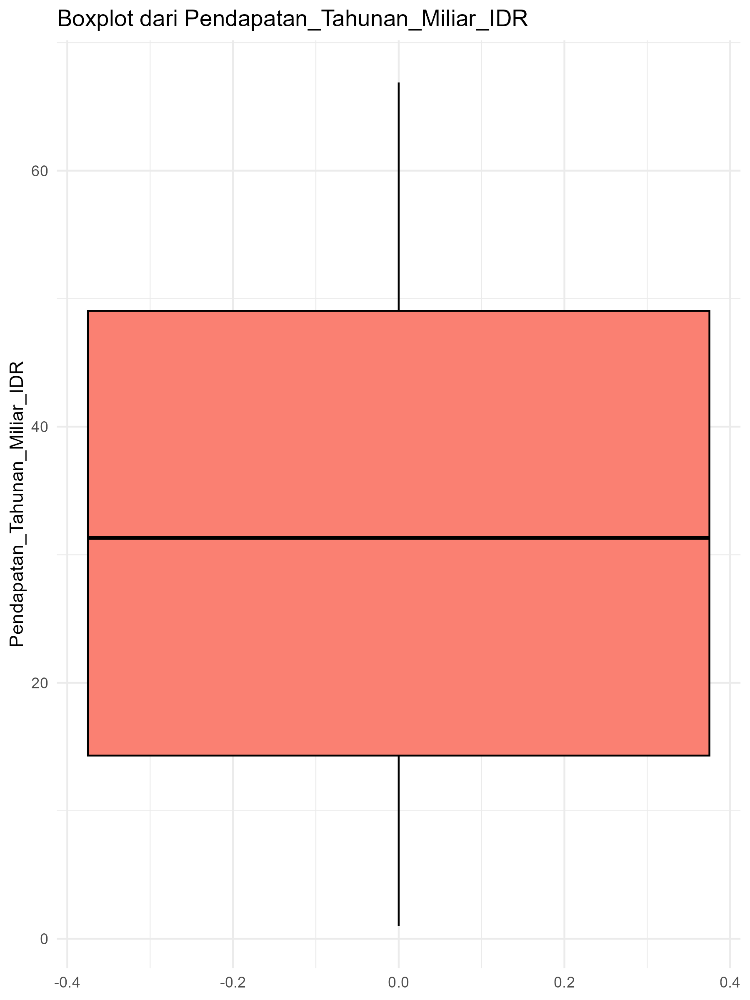
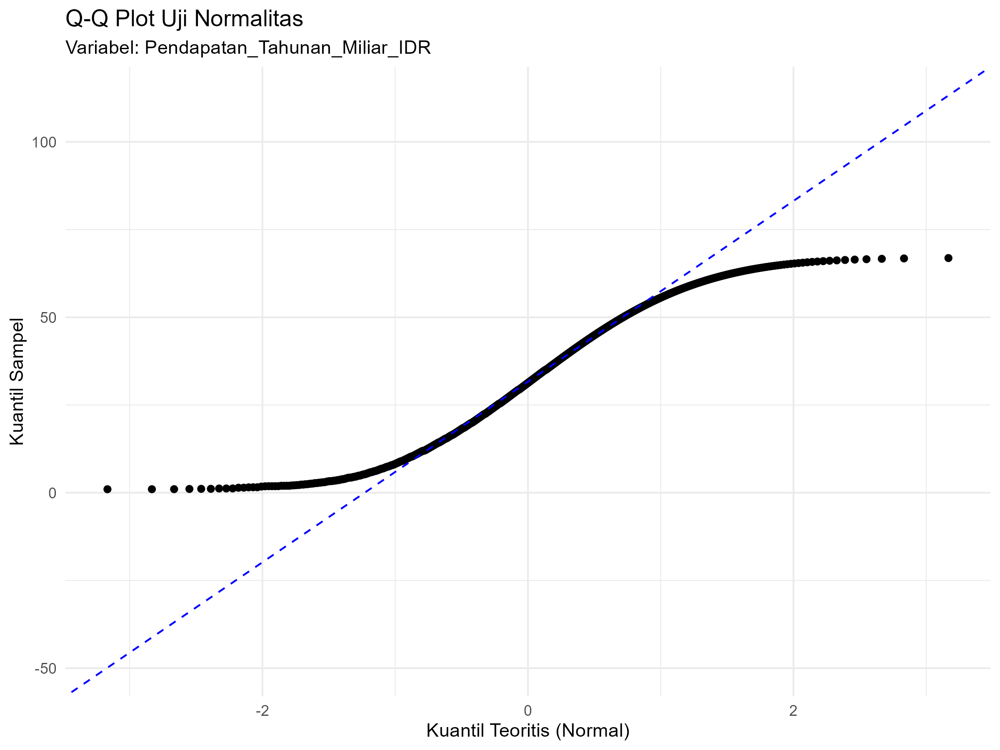
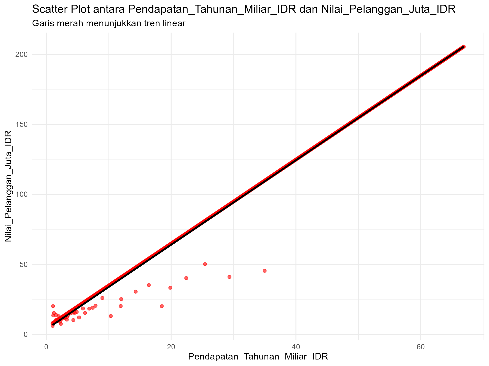
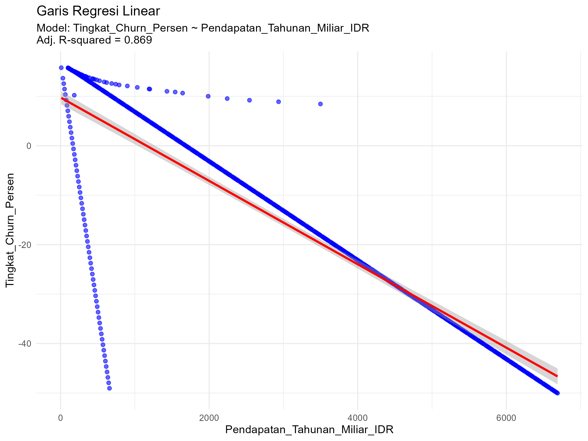
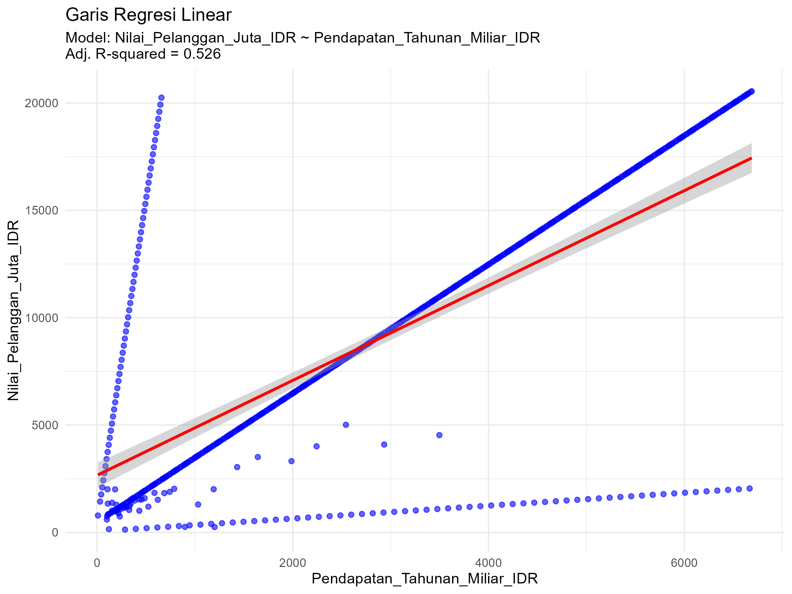
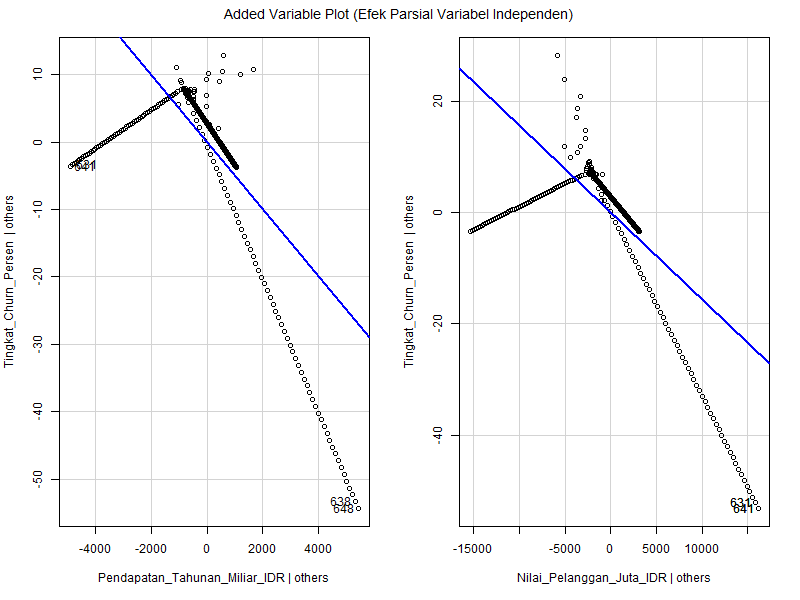

# Tugas Analisis Statistik: Deskriptif, Korelasi, dan Regresi

## 1. Informasi Penyusun

- **Nama:** `Made Artika Sari Dewi`
- **NIM:** `2515091054`
- **Program Studi:** `Sisitem Informasi`
- **Mata Kuliah:** Statistika dan Probabilitas

---

## 2. Deskripsi Proyek
Projek ini menggunakan dataset pelanggan yang memuat informasi menganai karakteristik ekonomi dan nilai pelanggan. Dataset tersebut mencakup beberapa variabel utama, yaitu Pendapatan Tahunan, Nilai Pelanggan, dan Tingkat Churn
Analisis diawali dengan statistik deskriptif untuk menggambarkan karakteristik data, meliputi perhitungan mean, median, modus serta sebaran data pada setiap variabel. Selanjutnya, dilakukan analisis korelasi untuk menguji hubungan antara Pendapatan Tahunan dan Nilai Pelanggan. Pada tahap akhir, digunakan analisis regresi untuk menganalisis pengaruh Pendapatan Tahunan dan Tingkat Churn terhadap Nilai Pelanggan

---

## 3. Struktur Proyek

Proyek ini diorganisir ke dalam beberapa folder:
- `/data`: Berisi dataset mentah yang digunakan untuk analisis.
- `/scripts`: Berisi semua skrip R yang digunakan dalam analisis, diurutkan berdasarkan alur kerja.
- `/results`: Berisi output dari analisis, seperti plot, gambar, atau tabel ringkasan.

---

## 4. Cara Menjalankan Analisis

Untuk mereproduksi hasil analisis ini, ikuti langkah-langkah berikut:
1. Pastikan Anda memiliki R dan RStudio terinstal.
2. Buka proyek R ini di RStudio.
3. Instal paket yang diperlukan dengan menjalankan perintah berikut di konsol R:
   ```R
   # install.packages(c("tidyverse", "corrplot", "knitr"))
   ```
4. Jalankan skrip di dalam folder `/scripts` secara berurutan, mulai dari `01_data_preparation.R` hingga `05_analisis_regresi.R`.

---

## 5. Hasil dan Interpretasi

Di bagian ini, mahasiswa diharapkan untuk menyajikan dan menginterpretasikan hasil dari setiap tahap analisis.

### 5.1. Statistik Deskriptif
- **Ukuran Pemusatan (Mean, Median, Modus):**
### Tabel Statistik Deskriptif
| Variabel                             |    Mean     |    Median   |    Modus   |
|--------------------------------------|-------------|-------------|------------|
| Pendapatan Tahunan (Miliar IDR)      | 31.88       | 31.3        | 1.87       |
| Biaya Akuisisi Pelanggan (Juta IDR)  | 33.50       | 33.08       | 3.21       |
| Nilai Pelanggan (Juta IDR)           | 100.02      | 98.71       | 10.11      |
| Tingkat Churn (%)                    | -14.79      | -14.39      | 13.55      |

**Interpretasi:**
- Berdasarkan hasil statistik deskriptif, variabel **Pendapatan tahunan** memiliki nilai rata - rata (mean) sebesar 31,88, median 31,30 dan modus 1,87. Nilai mean yang sedikit lebih besar daripada median menunjukkan bahwa data pendapatan tahunan cenderung **miring ke kanan**, yang berarti terdapat beberapa pelanggan dengan pendapatan lebih tinggi yang memengaruhi nilai rata - rata. Nilai modus yang jauh lebih kecil dibandingkan mean dan median menunjukkan bahwa pendapatan yang paling sering muncul berada pada tingkat yang lebih rendah.
- Pada variabel **biaya akuisisi pelanggan**, diperoleh nilai mean sebesar 33,50, median 33,08 dan modus 3,21. Nilai mean dan median yang hampir sama menunjukkan bahwa sebaran data biaya akuisisi pelanggan **cukup merapata.** Nilai modus yang lebih kecil mengindikasi bahwa biaya akusisi yang paling sering terjadi cenderung lebih rendah dibandingkan nilai rata - ratanya.
- Selanjutnya, variabel **biaya akusisisi pelanggan,** diperoleh nilai sebesar 100,02, median 98,71 dan modus 10,11. Nilai mean yang lebih besar daripada median menunjukkan bahwa distribusi nilai pelanggan **condong ke kanan,** yang menandakan adanya sebagian kecil pelanggan dengan nilai yang sangat tinggi sehingga menaikkan nilai rata - rata. Modus yang jauh lebih kecil menunjukkan bahwa sebagian besar pelanggan memiliki nilai yang lebih rendah dibandingkan dengan rata - rata keseluruhan.
- Sementara itu, pada variabel tingkat churn, diperoleh nilai mean sebesar -14,79, median -14,39, dan modus 13,55. Nilai mean dan median yang relatif berdekatan menunjukkan bahwa tingkat churn pelanggan secara umum berada pada kisaran yang cukup stabil. Perbedaan tanda antara nilai modus dan nilai rata-rata menunjukkan adanya variasi perilaku churn di antara pelanggan, yang kemungkinan dipengaruhi oleh perbedaan karakteristik atau segmen pelanggan.

- **Ukuran Sebaran (Standar Deviasi, Range, Kuartil):**
### Tabel Ukuran Sebaran
| Variabel                             | Std. Dev | Min   | Q1      | Median  | Q3      |  Max    |
|--------------------------------------|----------|-------|---------|---------|---------|---------|
| Pendapatan Tahunan                   | 19.79    | 1.00  | 14.31   |  31.30  |  49.04  |  66.89  |
| Biaya Akuisisi Pelanggan             | 20.03    | 2.56  | 15.23   |  33.08  |  50.92  |  68.77  |
| Nilai Pelanggan                      | 59.86    | 6.01  | 45.66   |  98.71  | 152.08  |  205.46 |
| Tingkat Churn (%)                    | 20.02    |-50.03 | -32.21  | -14.39  | 3.43    |  15.78  |

**Interpretasi**:
- Pada variabel **pendapatan tahunan pelanggan**, nilai standar deviasi sebesar 19,79 miliar IDR menunjukkan bahwa variasi pendapatan antar pelanggan **tergolong tinggi**. Rentang nilai yang cukup lebar, yaitu dari 1,00 hingga 66,89 miliar IDR, mengindikasikan adanya perbedaan pendapatan yang signifikan antar pelanggan. Nilai kuartil pertama (Q1) sebesar 14,31 miliar IDR dan kuartil ketiga (Q3) sebesar 49,04 miliar IDR menunjukkan bahwa 50% pelanggan memiliki pendapatan tahunan dalam rentang tersebut. Secara keseluruhan, sebaran data ini mencerminkan **karakteristik pelanggan yang heterogen** dari sisi kemampuan menghasilkan pendapatan.
- Pada variabel **biaya akuisisi pelanggan**, standar deviasi sebesar 20,03 juta IDR menunjukkan adanya **variasi biaya akuisisi yang cukup besar antar pelanggan**. Rentang nilai antara 2,56 hingga 68,77 juta IDR mengindikasikan perbedaan strategi dan intensitas akuisisi pada berbagai segmen pelanggan. Nilai kuartil pertama (Q1) sebesar 15,23 juta IDR dan kuartil ketiga (Q3) sebesar 50,92 juta IDR menunjukkan bahwa sebagian besar biaya akuisisi pelanggan berada pada kisaran tersebut, yang mencerminkan adanya **perbedaan pendekatan pemasaran terhadap segmen pelanggan yang berbeda**.
- Untuk variabel **nilai pelanggan**, nilai standar deviasi sebesar 59,86 juta IDR menunjukkan tingkat variasi data yang **sangat tinggi**. Rentang nilai yang luas, yaitu dari 6,01 hingga 205,46 juta IDR, mengindikasikan adanya perbedaan nilai ekonomi pelanggan yang signifikan. Nilai kuartil pertama (Q1) sebesar 45,66 juta IDR dan kuartil ketiga (Q3) sebesar 152,08 juta IDR menunjukkan bahwa 50% pelanggan berada pada rentang nilai tersebut, serta mengindikasikan keberadaan kelompok pelanggan bernilai tinggi yang **berkontribusi besar terhadap distribusi data**.
- Sementara itu, pada variabel **tingkat churn**, nilai standar deviasi sebesar 20,02% menunjukkan adanya variasi perilaku pelanggan yang **cukup besar dalam hal retensi**. Rentang nilai antara −50,03% hingga 15,78% mengindikasikan perbedaan tingkat churn yang cukup mencolok antar pelanggan. Nilai kuartil pertama (Q1) sebesar −32,21% dan kuartil ketiga (Q3) sebesar 3,43% menunjukkan bahwa sebagian besar nilai churn berada pada kisaran tersebut. Secara keseluruhan, sebaran data tingkat churn mencerminkan adanya **perbedaan pola retensi pelanggan di dalam dataset**.

- **Visualisasi (Histogram & Boxplot):**
### Histogram Pendapatan Tahunan (Miliar IDR)

**Interpretasi:**
 - Berdasarkan histogram Pendapatan Tahunan (dalam miliar IDR), distribusi data terlihat cenderung miring ke kanan (right-skewed). Hal ini menunjukkan bahwa sebagian besar perusahaan memiliki pendapatan tahunan pada kategori rendah hingga menengah, sementara hanya sebagian kecil perusahaan yang memiliki pendapatan sangat tinggi.
Garis merah putus-putus pada histogram menunjukkan nilai rata-rata (mean) sebesar 31,88 miliar IDR, yang posisinya berada lebih ke kanan dibandingkan dengan konsentrasi data. Kondisi ini mengindikasikan bahwa nilai pendapatan yang tinggi dari beberapa perusahaan berpengaruh terhadap besarnya nilai rata-rata, sehingga mean menjadi lebih besar.
Selain itu, sebaran data yang cukup lebar menunjukkan adanya variasi pendapatan tahunan yang cukup tinggi antar perusahaan. Oleh karena itu, variabel pendapatan tahunan layak digunakan sebagai variabel utama dalam analisis statistik deskriptif, karena mampu merepresentasikan pola distribusi dan variasi data perusahaan secara jelas.
    - ### Boxplot Pendapatan Tahunan (Miliar IDR)

**Intepretasi:**
- Berdasarkan boxplot dan tabel ukuran sebaran, pendapatan tahunan menunjukkan **variasi data yang cukup besar**. Nilai pendapatan minimum tercatat sebesar 1,00 miliar IDR, sedangkan nilai maksimum mencapai 66,89 miliar IDR, yang mengindikasikan bahwa **rentang data relatif lebar**.
- Nilai median pendapatan tahunan berada pada 31,30 miliar IDR, yang berarti separuh observasi memiliki pendapatan di bawah nilai tersebut dan separuh lainnya berada di atasnya. Kuartil bawah (Q1) sebesar 14,31 miliar IDR dan kuartil atas (Q3) sebesar 49,04 miliar IDR, sehingga nilai interquartile range (IQR) tergolong cukup besar. Hal ini menunjukkan bahwa sebaran pendapatan antar **objek pengamatan bersifat heterogen**.
- Secara visual, posisi median yang sedikit lebih dekat ke kuartil bawah serta whisker atas yang lebih panjang dibandingkan whisker bawah mengindikasikan bahwa distribusi pendapatan tahunan **cenderung miring ke kanan** (positively skewed). Artinya, terdapat beberapa perusahaan dengan pendapatan relatif tinggi yang menarik distribusi ke arah kanan.
- Nilai standar deviasi sebesar 19,79 miliar IDR turut memperkuat temuan ini, karena menunjukkan tingkat penyebaran data yang cukup besar terhadap nilai pusatnya. Berdasarkan boxplot, tidak terlihat adanya outlier ekstrem, namun variasi data tetap cukup tinggi.

### 5.2. Uji Normalitas
- Ringkasan Hasil Uji Shapiro-Wilk:
_Uji Normalitas dilakukan terhadap Tiga Variabel,_ yaitu **Pendapatan Tahunan, Nilai Pelanggan dan Tingkat Churn**. Pengujian ini bertujuan untuk memastikan pemenuhan asumsi distribusi data sebelum dilakukan **analisis korelasi** dan **analisis regresi**.
**1. Pendapatan Tahunan**
Statistik W : 0.94664
p-value : 1.497e-14
Keputusan : Tidak terdistribusi normal
**2. Nilai Pelanggan**
Statistik W : 0.94414
p-value : < 6.679e-15
Keputusan : Tidak terdistribusi normal
**3. Tingkat Churn (%)**
Statistik W : 0.94267
p-value : 3.942e-15
Keputusan : Tidak terdistribusi normal
**Interpretasi:**
   Berdasarkan hasil uji normalitas Shapiro–Wilk, ketiga variabel yang dianalisis, yaitu Pendapatan Tahunan, Nilai Pelanggan, dan Tingkat Churn (%), memiliki nilai p-value yang jauh lebih kecil dari 0,05. Dengan demikian, hipotesis nol (H₀) yang menyatakan bahwa data berdistribusi normal ditolak untuk seluruh variabel.
Hasil ini menunjukkan bahwa distribusi data pada ketiga variabel tersebut tidak mengikuti distribusi normal. Temuan ini sejalan dengan analisis visual sebelumnya (histogram dan boxplot) yang memperlihatkan adanya kemiringan distribusi (skewness) serta variasi data yang cukup besar.
Oleh karena itu, untuk menganalisis hubungan antar variabel, digunakan metode non-parametrik, yaitu korelasi Spearman, karena metode ini tidak mensyaratkan asumsi normalitas data dan lebih sesuai untuk data yang berskala ordinal atau memiliki distribusi tidak normal.

- **Plot Q-Q:**
  - 
  - *Interpretasi:*
- Titik-titik data tidak mengikuti garis lurus diagonal (garis merah) secara konsisten.
- Pada bagian kuantil rendah dan kuantil tinggi, titik-titik terlihat menyimpang cukup jauh dari garis normal.
- Pola lengkungan (tidak linear) menunjukkan bahwa distribusi data tidak simetris dan cenderung tidak normal.
Berdasarkan Q–Q plot, data Pendapatan Tahunan tidak terdistribusi normal, karena titik-titik data tidak mengikuti garis distribusi normal.

### 5.3. Analisis Korelasi
- **Nilai Koefisien Korelasi:**
  - Metode korelasi: Spearman
Koefisien korelasi (ρ): 0.706
p-value: < 0.05
  - **Interpretasi:**
Berdasarkan hasil analisis korelasi menggunakan **metode Spearman**, diperoleh nilai koefisien korelasi (ρ) sebesar 0,706 dengan nilai p-value < 0,05. Hasil ini menunjukkan bahwa terdapat hubungan yang positif dan kuat antara Pendapatan Tahunan dan Nilai Pelanggan. Artinya, peningkatan pendapatan tahunan cenderung diikuti oleh peningkatan nilai pelanggan. Hubungan tersebut bersifat signifikan secara statistik, sehingga dapat disimpulkan bahwa pendapatan tahunan memiliki keterkaitan yang bermakna dengan nilai pelanggan dalam data yang dianalisis.

- **Visualisasi (Scatter Plot):**
  - 
  - **Interpretasi**:
Pola sebaran pada scatter plot menunjukkan kecenderungan hubungan positif antara Pendapatan Tahunan dan Nilai Pelanggan. Meskipun data tidak sepenuhnya membentuk hubungan linear yang sempurna dan terdapat variasi serta outlier, arah tren yang meningkat secara konsisten mendukung hasil koefisien korelasi Spearman sebesar 0,706 yang menunjukkan hubungan positif dan kuat.

### 5.4. Analisis Regresi
- **Model Regresi:**
  -  **Y = b0 + b1X₁ + b2X₂**
  - Keterangan :
  Y = Y = Tingkat_Churn_Persen
  X₁ = Pendapatan_Tahunan_Miliar_IDR
  X₂ = Nilai_Pelanggan_Juta_IDR
- Dari bagian Coefficients:
Intercept (b₀) = 13,87
Pendapatan_Tahunan_Miliar_IDR (b₁) = -0,004967
Nilai_Pelanggan_Juta_IDR (b₂) = -0,001564
- *Persamaan regresi:*
- Tingkat Churn (%) = 13,87 − 0,004967(Pendapatan Tahunan) − 0,001564(Nilai Pelanggan)
  - **Interpretasi:**
   Berdasarkan hasil **Analisis Regresi Berganda** dengan variabel dependen **Tingkat_Churn_Persen** serta variabel independen **Pendapatan_Tahunan_Miliar_IDR** dan **Nilai_Pelanggan_Juta_IDR**, diperoleh intepretasi koefisien sebagai berikut:
- **Intercept (b0)**
Nilai intercept (b0) sebesar **13,87** menunjukkan bahwa ketika pendapatan tahunan dan nilai pelanggan bernilai nol (0), maka tingkat churn pelanggan diperkirakan sebesar **13,87%**. Nilai ini merupakan titik awal model dan bersifat teoritis, karena dalam praktik kondisi seluruh variabel independen bernilai nol jarang terjadi
- **Slope (b1) - Pendapatan Tahunan**
Koefisien slope (b1) untuk variabel Pendapatan_Tahunan_Miliar_IDR sebesar -0,004967 menunjukkan bahwa setiap peningkatan 1 miliar rupiah pendapatn tahunan akan menurunkan tingkat churn pelanggan sebesar sekitar 0,005% dengan nilai pelanggan dianggap **konstan**. Tanda negatif pada koefisien menunjukkan bahwa hubungan yang berlawanan antara pendapatan tahunan dan tingkat churn.
- **Slope (b2) - Nilai Pelanggan**
Koefisien slope (b2) untuk variabel Nilai_Pelanggan_Juta_IDR sebesar -0,001564 menunjukkan bahwa setiap peningkatan 1 juta rupiah nilai pelanggan akan menurunkan tingkat churn pelanggan sebesar sekitar 0,0016% dengan pendapatan tahunan dianggap **konstan**. Hal ini menunjukkan bahwa semakin tinggi nilai pelanggan, maka kecenderungan pelanggan untuk berhenti (churn) semakin rendah.

- **Evaluasi Model (R-squared):**
  - *Nilai R-squared* : **Adjusted R-squared = 0.869 atau 86.9 %**
  - **Interpretasi**:
Berdasarkan hasil analisis regresi, diperoleh nilai Adjusted R-squared sebesar **0,869**. Hal ini menunjukkan bahwa sebanyak **86,9%** variasi pada variabel dependen, yaitu **Tingkat_Churn_Persen**, dapat dijelaskan oleh model regresi yang terdiri dari **variabel Pendapatan_Tahunan_Miliar_IDR**dan **Nilai_Pelanggan_Juta_IDR** secara simultan.
Sementara itu,**13,1% variasi sisanya dijelaskan oleh faktor lain di luar model regresi yang tidak diteliti dalam penelitian ini.**

- **Visualisasi (Garis Regresi pada Scatter Plot):**
- Analisis ini dilengkapi dengan **dua plot regresi linear** yang menunjukkan hubungan antara:
- Tingkat_Churn_Persen dan Pendapatan_Tahunan_Miliar_IDR  
- Tingkat_Churn_Persen dan Nilai_Pelanggan_Juta_IDR  
Selain itu, digunakan pula **Added-Variable Plots (AVPlots)** untuk mengevaluasi **pengaruh parsial** masing-masing variabel independen dalam model regresi linear berganda.
  - **Gambar 1 Plot Tingkat_Churn_Persen dan Pendapatan_Tahunan_Miliar_IDR**
 - 
 - **Intepretasi: Plot Tingkat_Churn_Persen dan Pendapatan_Tahunan_Miliar_IDR**
 Plot regresi linear ini menunjukkan hubungan antara Pendapatan Tahunan (dalam miliar IDR) dengan Tingkat Churn (dalam persen). Titik-titik biru pada grafik merepresentasikan data aktual, sedangkan garis merah menunjukkan garis regresi linear yang menggambarkan tren hubungan antara kedua variabel tersebut.
Berdasarkan grafik, terlihat bahwa garis regresi memiliki kemiringan negatif, yang berarti terdapat hubungan terbalik antara pendapatan tahunan dan tingkat churn. Dengan kata lain, semakin tinggi pendapatan tahunan, maka tingkat churn cenderung semakin rendah. Hal ini menunjukkan bahwa entitas dengan pendapatan yang lebih besar memiliki kecenderungan lebih kecil untuk kehilangan pelanggan.
Nilai Adjusted R-squared sebesar 0,869 menunjukkan bahwa sekitar 86,9% variasi tingkat churn dapat dijelaskan oleh variabel pendapatan tahunan. Nilai ini tergolong tinggi, sehingga model regresi yang digunakan dapat dikatakan cukup baik dan kuat dalam menjelaskan hubungan antara pendapatan dan churn.
Secara keseluruhan, grafik ini mengindikasikan bahwa pendapatan tahunan merupakan faktor yang berpengaruh signifikan terhadap tingkat churn, meskipun faktor lain di luar model tetap mungkin memengaruhi nilai churn.
 - **Gambar 2 Plot Tingkat_Churn_Persen dan Nilai_Pelanggan_Juta_IDR**
- 

- **Intepretasi:**
  Plot regresi linear ini menunjukkan hubungan antara Nilai Pelanggan (dalam juta IDR) dengan Tingkat Churn (dalam persen). Titik-titik pada grafik merepresentasikan data aktual, sedangkan garis regresi menunjukkan arah dan pola hubungan linear antara kedua variabel tersebut.
Dari grafik terlihat bahwa garis regresi memiliki kemiringan negatif, yang menandakan adanya hubungan terbalik antara nilai pelanggan dan tingkat churn. Artinya, semakin tinggi nilai pelanggan, maka tingkat churn cenderung semakin rendah. Pelanggan dengan nilai yang lebih besar cenderung lebih loyal dan tidak mudah berhenti.
Nilai Adjusted R-squared sebesar 0,869 menunjukkan bahwa sekitar 86,9% variasi tingkat churn dapat dijelaskan oleh variabel nilai pelanggan. Nilai ini tergolong tinggi, sehingga model regresi yang digunakan memiliki kemampuan yang baik dalam menjelaskan hubungan antara nilai pelanggan dan churn.
Meskipun terdapat beberapa data yang menyebar cukup jauh dari garis regresi, pola keseluruhan tetap menunjukkan tren yang konsisten. Hal ini mengindikasikan bahwa nilai pelanggan merupakan salah satu faktor penting dalam memengaruhi tingkat churn, meskipun faktor lain di luar model juga dapat berperan.

**Visualisasi (Gambar 3 Regresi pada avPlots):**

AVPlots digunakan untuk mengevaluasi pengaruh parsial masing-masing variabel independen terhadap Tingkat_Churn_Persen.

- **Interpretasi : avPlots**
Added Variable Plot (AV Plot) ini digunakan untuk melihat pengaruh masing-masing variabel independen terhadap tingkat churn, dengan asumsi variabel independen lainnya sudah dikendalikan (dianggap konstan). Pada grafik ini terdapat dua plot, yaitu untuk Pendapatan Tahunan dan Nilai Pelanggan.

**1. AV Plot Pendapatan Tahunan**
Plot sebelah kiri menunjukkan hubungan antara Pendapatan Tahunan (setelah mengontrol variabel lain) dengan Tingkat Churn. Terlihat bahwa garis tren memiliki kemiringan negatif, yang berarti bahwa ketika pendapatan tahunan meningkat, tingkat churn cenderung menurun, meskipun pengaruh variabel lain telah diperhitungkan.
Sebaran titik yang relatif mengikuti arah garis tren menunjukkan bahwa pendapatan tahunan memberikan kontribusi nyata dalam menjelaskan perubahan tingkat churn.

**2. AV Plot Nilai Pelanggan**
Plot sebelah kanan menggambarkan hubungan antara Nilai Pelanggan (setelah mengontrol variabel lain) dengan Tingkat Churn. Sama seperti plot sebelumnya, garis tren juga menunjukkan hubungan negatif. Artinya, semakin tinggi nilai pelanggan, maka tingkat churn cenderung semakin rendah, bahkan setelah pengaruh variabel pendapatan tahunan dikendalikan.
Pola titik yang cukup konsisten dengan garis tren menandakan bahwa nilai pelanggan juga memiliki pengaruh signifikan terhadap tingkat churn.

---

## 6. Kesimpulan
- **Rangkuman Script 2 - Script 5**
 - **1. Statistika Deskriptif dan Visualisasi**
- Pendapatan tahunan, biaya akuisisi dan nilai pelanggan menunjukkan distribusi data yang **bervariasi tinggi**, dengan sebagian nilai ekstrem yang memengaruhi rata - rata
- Tingkat churn pelanggan bervariasi, namun secara umum berada pada kisaran yang relatif stabil
- Histogram dan boxplot membantu memvisualisasikan sebaran data, distribusi miring dan variasi antar pelanggan
 - **2. Uji Normalitas**
Semua variabel utama (Pendapatan Tahunan, Nilai Pelanggan, dan Tingkat Churn) **tidak terdistribusi normal**, sehingga analisis korelasi dilakukan menggunakan metode **Spearman** yang non-parametrik
 - **3. Analisis Korelasi**
Terdapat hubungan **positif dan kuat** antara Pendapatan Tahunan dan Nilai pelanggan (ρ = 0,706, p < 0,05), menunjukkan bahwa peningkatan pendapatan tahunan cenderung diikuti oleh peningkatan nilai pelanggan
 - **4. Nilai Regresi Berganda**
- Model regresi menunjukkan bahwa **Pendapatan Tahunan** dan **Nilai Pelanggan** memiliki pengaruh negatif terhadap tingkat churn. Artinya, semakin tinggi pendapatan atau nilai pelanggan, semakin rendah kemungkinan churn
- Adjusted R-squared sebesar **89,9%** menunjukkan bahwa model mampu menjelaskan sebagian besar variasi tingkat churn
- AVPlots menegaskan bahwa kedua variabel independen memberikan kontribusi signifikan secara persial terhadapt perubahan tingkat churn
 - **Tambahan**
  Analisis ini menekankan pentingnya mengombinasikan **statistik deskriptif, visualisasi** dan **analisis hubungan antar variabel** agar hasil penelitian lebih mudah dipahami dan dapat digunakan sebagai dasar untuk pengambilan keputusan. Dan, kemampuan dalam mebuat plot (histogram, boxplot, scatter plot) sekaligus mengintepretasikan hasil statistik menjadi kunci untuk memahami data secara menyeluruh.

 terimakasi:)
